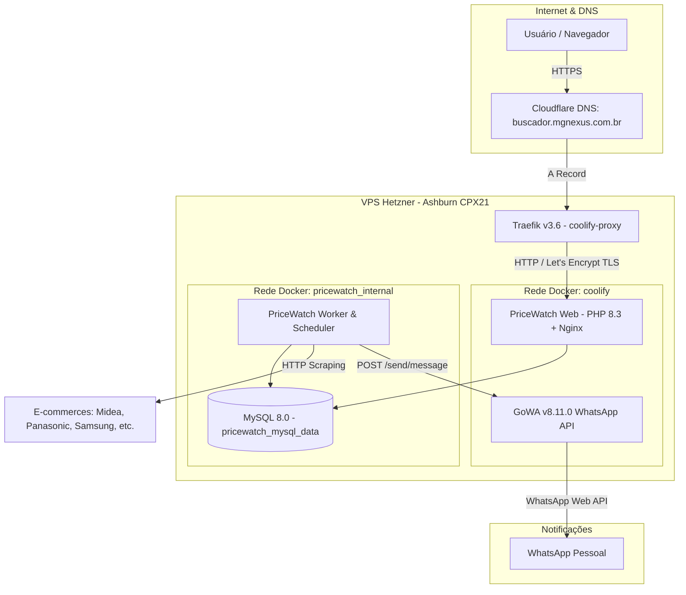

# PriceWatch — Arquitetura do Sistema

## Visão Geral
O **PriceWatch** é uma solução de monitoramento automatizado e histórico de preços para e-commerce, construído com foco inicial em três lavadoras 220V de alta capacidade.

## Diagrama da Arquitetura

## Componentes do Sistema

1. **Camada de Aplicação:**
   - **Framework:** Laravel 13 com PHP 8.3 FPM.
   - **Painel Administrativo:** Filament 5 com autenticação dedicada.
   - **Web Server:** Nginx interno conteinerizado com PHP-FPM gerenciados por Supervisord.

2. **Banco de Dados & Persistência:**
   - **SGBD:** MySQL 8.0 dedicado em rede interna não exposta.
   - **Volume:** `pricewatch_mysql_data` persistente.
   - **Imutabilidade:** Observações de preços (`price_observations`) e execuções (`collection_runs`) nunca são sobrescritas.

3. **Pipeline de Coleta (`CollectionPipeline`):**
   - **Ordem de prioridade:** API Oficial > JSON-LD (Schema.org Product) > Microdados HTML.
   - **Validação Eliminatória:** Se o modelo ou voltagem não conferirem (ex: oferta 127V quando esperado 220V), a observação é gravada como `mismatch` e nenhum alerta é disparado.
   - **Outlier Guard:** Bloqueio de valores absurdos ou R$ 0,00.

4. **Notificações & Alertas:**
   - **Canal:** GoWA (`v8.11.0`) rodando no container `gowa-u08ccgc004ko484kk4oo0wk0` via porta 3000 interna com Basic Auth.
   - **Regras:** Alerta de Preço Alvo e Menor Preço Histórico.
   - **Deduplicação & Cooldown:** Janela de 24h para evitar notificações repetidas pelo mesmo valor.

5. **Infraestrutura & Segurança:**
   - **Proxy Reverso:** Traefik v3.6 existente (gerenciado pelo Coolify), emitindo certificados Let's Encrypt automaticamente.
   - **Limites de Recursos:**
     - `pricewatch_app`: 0.75 CPU / 512 MB RAM
     - `pricewatch_worker`: 0.50 CPU / 256 MB RAM
     - `pricewatch_db`: 0.50 CPU / 512 MB RAM
